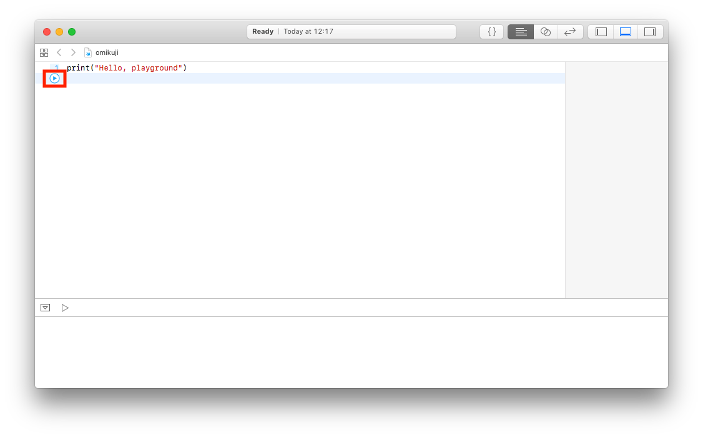
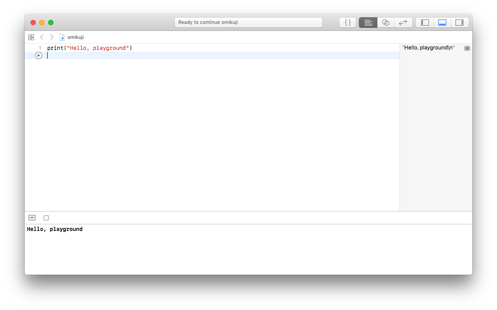

# 第1回

## 目標

- Swiftに慣れる

## やること

- playgroundを触ってみる
- Swiftを書いてみる

## 手順

今回はあまり手順らしい手順がありません

1. playgroundを立ち上げる

    playground/omikuji.playgroundを開きます

    

    赤色で囲った再生ボタンを押すとプログラムが実行されます。

    

    playgroundでは、Swiftのコードを実行する事ができます(**Objective-Cのコードを実行することはできない**)

2. 実際に触ってみよう

    Yeah!